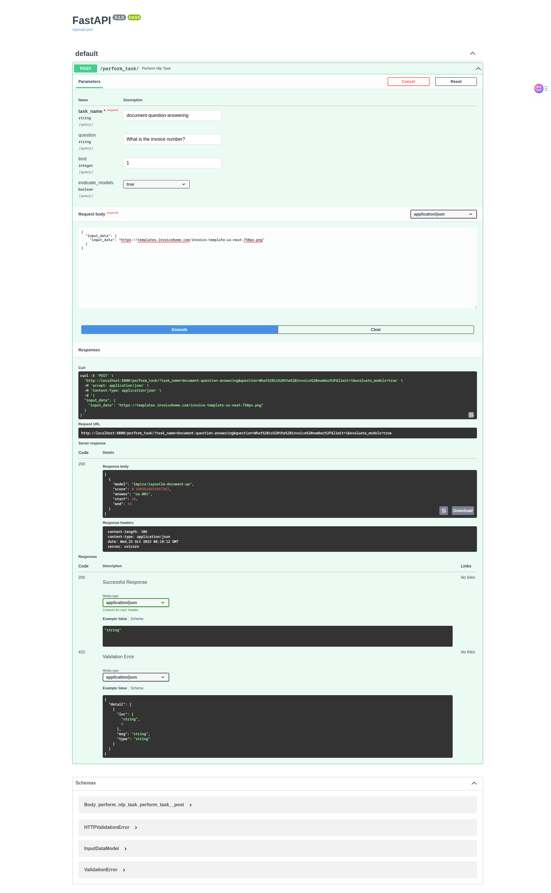
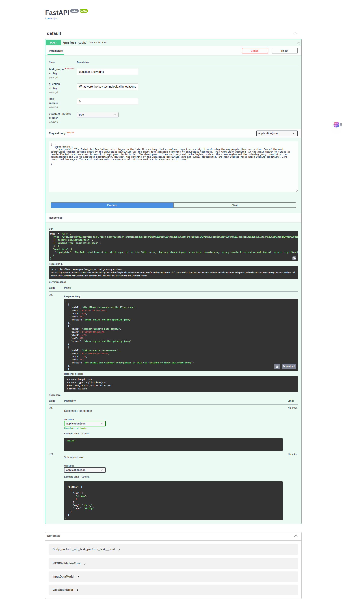
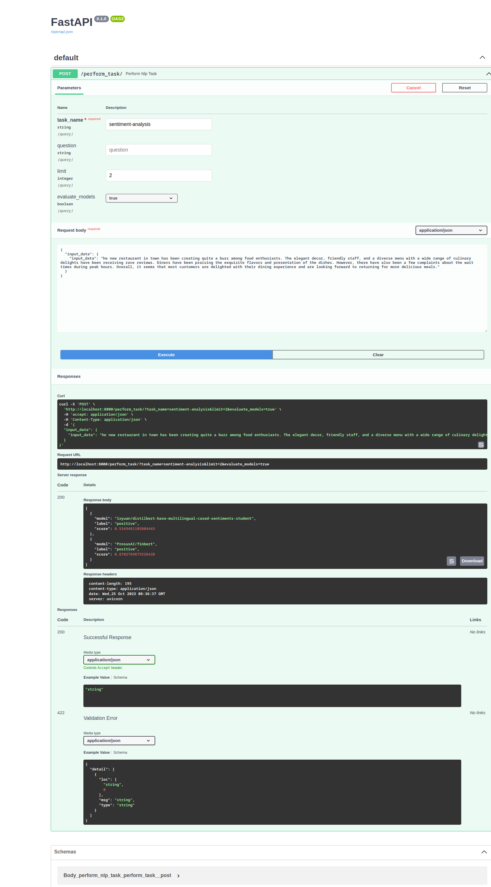

Large Language Models
======================

In a world filled with data, language is your key to making sense of it all. It turns complex information into simple
insights, answers questions in a snap, and helps you understand the emotions behind words.

|

Bluemist AI integrates seamlessly with Hugging Face Transformers, empowering users to accomplish various natural
language processing tasks effortlessly. With this integration, you can perform document question answering, generate
insightful responses to questions, summarize lengthy text for easier understanding, and analyze sentiment within text.
The wrapper simplifies the utilization of powerful models, enhancing productivity and enabling effective interpretation
of textual data.

|

.. automodule:: bluemist.llm
   :members:
   :undoc-members:
   :show-inheritance:
   :exclude-members: get_context_input_type, is_model_supported_by_task, is_question_supported, populate_tasks, tasks

|

Document Question Answering
---------------------------

Document Question Answering (DQA), also known as Document Visual Question Answering, involves leveraging multi-modal
features to answer questions about document images in natural language. It combines text, word positions, and images
to generate meaningful responses. An illustrative example showcases DQA balancing cost efficiency with quality customer
service in response to specific queries. DQA models prove versatile, adaptable to visually-rich and non-visually-rich
documents, aiding in structured document parsing and invoice information extraction.

For more details, refer https://huggingface.co/tasks/document-question-answering

.. raw:: html
    :file: ../code_samples/quickstarts/llm/huggingface/document_question_answering.html

|

Question Answering
------------------

Question Answering (QA) models provide answers to questions based on a given text, aiding in document search and
automating responses to frequently asked questions. These models can generate answers either with or without context.
QA models can be utilized with the HuggingFace Transformers library using the question-answering pipeline, and various
task variants can be addressed.

For more details, refer https://huggingface.co/tasks/question-answering

.. raw:: html
    :file: ../code_samples/quickstarts/llm/huggingface/question_answering.html

|

Summarization
-------------

Summarization models are designed to create concise versions of given documents while preserving crucial information.
The process involves extracting or generating shorter text while maintaining the essence of the original content.
Users can benefit from this tool in various scenarios, such as summarizing research papers for efficient literature
review, or condensing lengthy paragraphs for improved understanding. The integration with Hugging Face Transformers
allows for effortless implementation and utilization of state-of-the-art summarization models. With a simple API call,
users can summarize any given text using pre-trained models, making content processing and comprehension more efficient.

For more details, refer https://huggingface.co/tasks/summarization

.. raw:: html
    :file: ../code_samples/quickstarts/llm/huggingface/summarization.html

|

Sentiment Analysis
------------------

Sentiment Analysis models facilitates the understanding of sentiments conveyed within a given piece of text. It
classifies the sentiment as positive, negative, or neutral, enabling valuable insights into the emotional tone of
textual content. Users can apply this tool across a range of applications, from social media monitoring to product
reviews analysis, helping businesses gauge public opinion and make informed decisions. The integration seamlessly
connects users to state-of-the-art sentiment analysis models, simplifying the process and providing accurate sentiment
assessments with ease.

For more details, refer https://huggingface.co/blog/sentiment-analysis-python

.. raw:: html
    :file: ../code_samples/quickstarts/llm/huggingface/sentiment_analysis.html

|

Code Samples and API deployment
-------------------------------

Jupyter notebook with code samples for document-question-answering, question-answering, summarization
and sentiment-analysis

.. raw:: html
    :file: ../code_samples/quickstarts/llm/llm_jupyter_notebook.html

|

To test the API, open the browser and navigate to `<http://localhost:8000/docs>`_

|

**API handbook for Document Question Answering**

|

**API handbook for Question Answering**

|

**API handbook for Sentiment Analysis**

|

**API handbook for Summarization**

.. image:: ../code_samples/quickstarts/llm/llm_summarization.png
